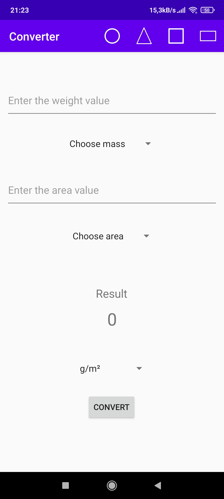

# Calculation-mobile-app
App for easy weight conversion. You can enter grammage and area, and convert it in any way you like.

## Technologies
Project is created with:
* Java
* XML
* Android Studio

## Application views
  
  
